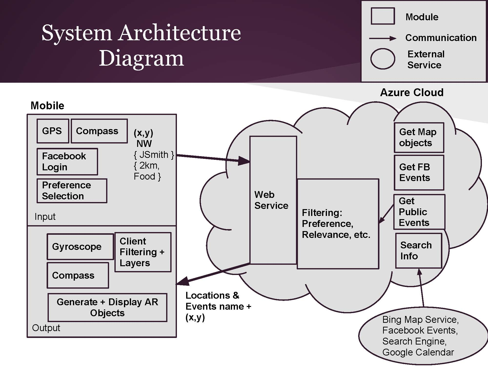
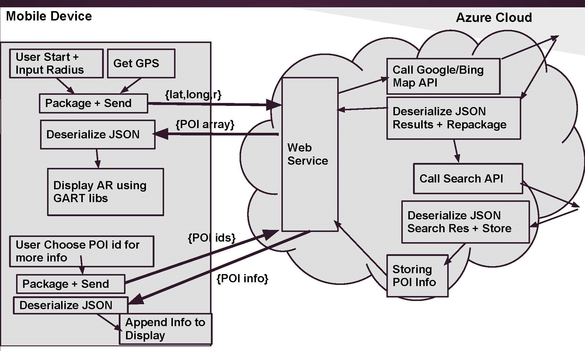

##Augmented Reality World Explorer repository

AR World Explorer is an augmented reality app that provides relevant useful information about places and social events happening around the users. This information is presented in real-time, in the form of augmented reality labels, as users point their smartphones camera towards the areas of interest.

Information includes: building names, historical facts, food/shopping places, reviews, personal tagged locations, social networking events.

##Use Cases:

1. Exploring Local Area

   Steps:
  * Open app, chooses Local layer. Points smartphone camera towards an area.
  * Check labels with place names on screen. Click on label, see larger tab with more information about the place.
  * Example: John is a tourist visiting St. Paul downtown. He spots a nice historic looking building and points his phone towards the building’s direction. A label saying “Minnesota State Capitol” next to the building will show up on his phone’s display. Clicking on the label expands to a larger tab showing historical information, opening hours of the building.

2. Looking for Places

   Steps:
  * Open app, chooses Food layer. Scan around with the smartphone camera.
  * Checkout labels of nearby restaurants. Click on label, see tab with more information.
  * Example: Paul is traveling in Barcelona. He scans his phone around with the app on to see there are any good restaurants nearby for lunch. He sees several labels on screen showing where they are. He chooses one restaurant and its larger tab shows the recent customer reviews, opening hours and outside streetview.

3. Checking out Social Events

   Steps:
  * Open app, choose Events layer. Scan around with smartphone camera
  * See labels of nearby Facebook Events. Click on label, sees more information on Event.
  * Example: Paul is traveling in Barcelona. He scans his phone around with the app on to see there are any good restaurants nearby for lunch. He sees several labels on screen showing where they are. He chooses one restaurant and its larger tab shows the recent customer reviews, opening hours and outside streetview.

4. Saving Custom Locations

   Steps:
  * Open app, choose Personal layer. Tag current location on the app
  * Check this label later for the exact location and its direction
  * Example: Marie just parked her car at the Mall of America. She immediately places a tag of her current position using the app. Later, she can locate her car by checking out its AR label.Worker Role instances may be needed to get details for many distinct places/events.

###Design 
The system design includes a lightweight mobile client on Windows Phone, and a backend component running on Windows Azure Cloud Service (Web Role and Worker Role instances) and Azure Storage (Table, Queue and Blob storages).

1. Leveraging The Cloud: 

    Network-intensive operations such as searching for locational information of the phone using Google/Bing maps and grabbing information from social networks, streetview images and other sources will all be done on Azure, which can save battery life and lessen data usage for the mobile devices. In using the cloud, we include several optimizations such as caching, data filtering, data aggregation and result predictions.

2. Data Filtering & Aggregation: 

    Since the cloud retrieves information regarding all places and events nearby the users ahead of their requests: We can filter out and send back only details for the requested point of interest and limited number of additional interested locations. The cloud also can also make many connections to multiple information sources to gather more details for a particular location. This aggregates data and the mobile only has to make one connection to the cloud to get all the necessary information.

3. Predictions:

    Since data filtering holds back from sending extra information about other places to the mobile (improving energy/data bandwidth saving), this can hurts performance if users decide to view details on another place on screen (higher latency, waiting to fetch from the cloud). Our system tries to balance the tradeoff between Energy/Data and Performance by introducing predictions: the cloud sends back details about additional places, it tries to be smart in selecting locations that users may be interested in, based on current time, access patterns, friends list, etc.

4. GART Library:

    The GART library integrates Augmented Reality into a Windows Phone app using the Motion API shipped with Windows Phone Mango (WP7.5). GART is used to to generate the AR labels from coordinates sent from the cloud. The phone will pass location coordinates (received as part of the cloud’s JSON response for basic requests) into GART lib which will calculate the appropriate display location for the AR labels, containing place names and links to a page for information, which are made to appear on screen. The use of the GART library not only simplifies the code on the mobile side but allows to provide our application with more functionality i.e. with the different layers (food, social, personal) to filter place search results.

5. Caching Policy:

   Caching is implemented in addition to saving larger / more detailed information in Azure Storage because such data can only be accessed from Azure Storage Tables by Place ID: this will only be available after having made a previous request using external Place Search APIs (i.e. Google) on the same place. Without initial knowledge of Place IDs, we would have been forced to make redundant requests on places as the desired information may already be in storage. Thus, caching contributes to delaying - if not preventing - the immediate maxing out API quotas.

  * Place objects (name, lat, lng, ID) of corresponding basic place info responses are saved in a hash table with timestamps.
  * Basic place info requests first look into the populated hash table before resorting to making external API requests; a response to the request is built from available place objects.
  * Depopulation of hash table is triggered by some specified object count threshold during which objects with timestamps within a specified time threshold are removed.

6. Social Integration:

   ARWorldExplorer leverages the social media information to provide a better experience for the users. The Social layer is an important part of the App, allowing users to interact with their social network through Augmented Reality interface. Facebook access token is used by Facebook apps to access user’s data without having to asking for permissions too frequently. On the mobile device, after user connects with an app using Facebook Login (managed by Facebook), the app can access user’s public information (public profile and friendlist). If an app wants to access other private or sensitive information, there will be a Login Dialog, which lets the user know which permissions he/she is going to expose to the app. After the login process is finished, the app would be provided an access_token. The access_token can be invalidated by two ways:
  * It can expire after a specific period, which could be a few hours for short-lived tokens or a few days for long-lived tokens (which can be requested with the short-lived tokens).
  * The user chooses to stop exposing information to the app. 

    On the cloud, we retrieve the users Facebook information using Facebook Query Language (FQL), which allows querying Facebook user data by using a SQL-style interface. It also allows batching multiple queries into a single call. Data returned from an FQL query is in JSON format by default. The cloud currently obtains facebook events details, friends in attendance list for each event, and friends check-ins information.

7. Scalability:

    Azure Cloud Service allows us to control the scaling level and memory usage in Azure. Web Role and Worker Role can scale independently from each other, giving us the flexibility to control resources for optimal pricing while still maintaining the service availability.
For example:
  * In case where there are many users accessing from a few locations, more Azure Web Role instances can handle the higher amount of incoming requests, while only 1 Worker Role instance is needed to process the workload of gathering the extra details.
  * In another case where there are fewer users accessing from many geographically distributed locations, then just 1 Web Role is sufficient to handle requests, but multiple Worker Role instances may be needed to get details for many distinct places/events.

8. Sample Data Flow / Function Calls

